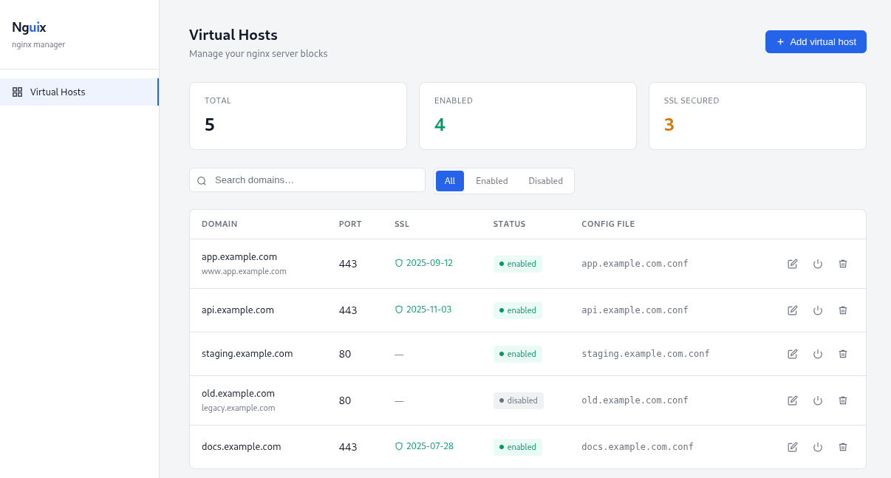
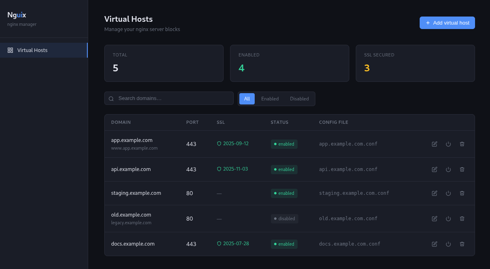

# Nguix

A lightweight web UI to manage nginx virtual hosts.

Browse, enable, disable and delete your server blocks from a clean interface — no CLI required.




## Features

- List all virtual hosts from `sites-available`
- See which ones are enabled, their port, SSL status and proxy target
- Enable / disable / delete vhosts
- Light and dark theme
- **Zero runtime dependencies** — only dev dependencies for type checking

## Stack

| Layer    | Tech                               |
| -------- | ---------------------------------- |
| Frontend | HTML + CSS + vanilla JS            |
| Backend  | Node.js 24+ with native TypeScript |

## Requirements

- Node.js 24.11 or later
- nginx installed on the same machine
- Read/write access to `/etc/nginx/sites-available` and `/etc/nginx/sites-enabled`

## Getting started

```bash
$ cd back
$ cp sample.env .env
$ npm run start
```

Then open [http://localhost:3001](http://localhost:3001).

The backend serves the frontend directly — no separate dev server needed.

## License

AGPL v3
